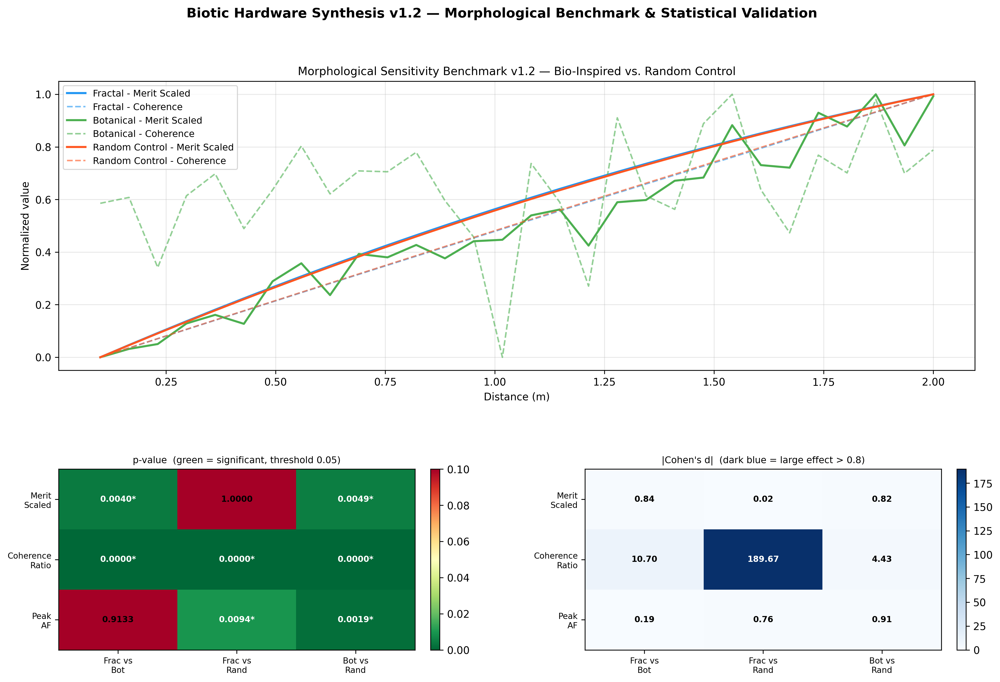

# Overview: Biotic Hardware Synthesis (v1.0)

## Overview
This repository implements a reproducible Python pipeline for simulating abstract coupled network dynamics and generating structured numerical outputs.

---

## Pipeline
The system executes a fixed workflow:

1. Parameter initialization
2. Network coupling simulation (spatial phased interactions)
3. Sensitivity analysis and visualization

Run:

python run.py

---

## Outputs

- data/simulation_results.csv  
- data/sensitivity_analysis.png  

---

## Key Result

---

## Scope
This system is strictly computational.

It does not model or validate physical electromagnetic, biological, or hardware systems.

All parameters and behaviors exist in an abstract simulation space.

---

## Version
v1.0 is a frozen baseline for reproducibility.