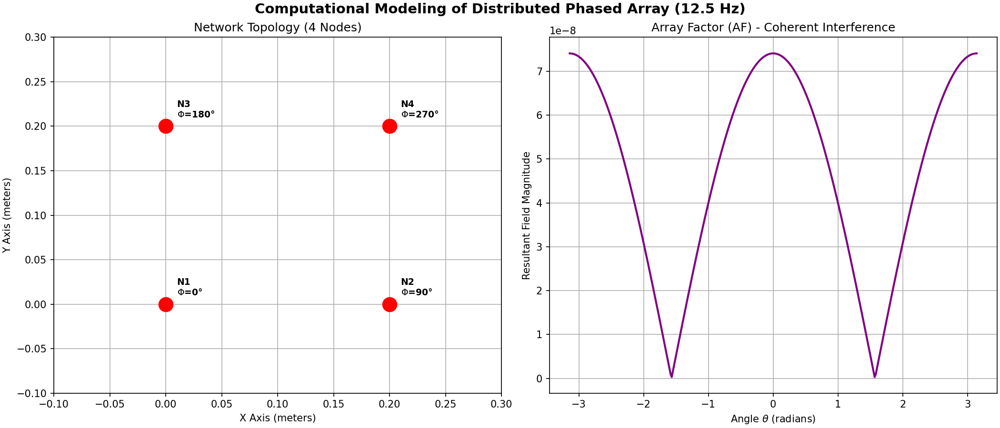

# Biotic Hardware Synthesis: A Computational Framework for Bio-Inspired ELF Resonant Architectures

This repository presents a **computational framework for network-based simulation in Extremely Low Frequency (ELF) regimes**, using morphological datasets as structured inputs for abstract graph-based and lumped-element system modeling.

It implements a generative approach in which morphological structures (derived from MS 408 / Voynich Manuscript) are mapped into simplified electromagnetic analogues, enabling the study of their behavior within coupled-oscillator and network simulation frameworks.

The system is strictly computational and interpretative. It does not represent a physical or biological implementation, but instead explores whether complex morphological patterns can serve as consistent generative structures for abstract network topology construction and simulation.

The framework is intended for exploratory modeling, sensitivity analysis, and structural experimentation in systems inspired by network physics and morphological computation. It further situates these simulations within a computational modeling context, where structural consistency can be analyzed using numerical electromagnetic solvers such as HFSS or CST, following an explicit embedding of the abstract network representation into a physically defined geometry and material parameter space.

---

## Quick Start

To run the full computational simulation pipeline:

    python run.py

This command executes the complete workflow in sequence:

- Node-level efficiency parametric analysis ($R_r \rightarrow 0$ limits)
- Distributed Phased Array simulation (Beamforming and spatial phase switching)
- Generation of the coherent interference pattern (Array Factor)

The pipeline automatically outputs strict numerical logs to the console and generates the high-precision spatial interference visualization.

---

## Key Research Points

- **Perspective:** Application of signal engineering, applied physics modeling, and bio-inspired computational design to morphological datasets extracted from MS 408.
- **Model:** Modular conceptual architecture based on Near-Field Magnetic Induction (NFMI) network representations using lumped-element approximations and coupled oscillator models.
- **Methodology:** Structural mapping of geometric patterns into graph-based electromagnetic analogues, intended for computational simulation and sensitivity analysis rather than direct physical interpretation.

Simulation baseline:  
[/data/parameters.json](./data/parameters.json)

---

## Objective

- **Computational Hypothesis:** Explore whether morphological datasets (such as MS 408 illustrations) can serve as structured input for generating consistent electromagnetic network topologies in simulation environments.
- **Open Exploration:** Provide reproducible computational tools for simulation, critique, and extension by the research community.
- **Interdisciplinary Inquiry:** Bridge concepts from systems engineering, network physics, and computational morphology for exploratory modeling.

---

## Dataset Rationale (MS 408)

MS 408 (Voynich Manuscript) is used in this project as a morphological dataset.

The choice is not based on any assumed historical, physical, or scientific property of the manuscript. Instead, MS 408 is used because it provides a highly complex and ambiguous visual structure that is useful for testing whether abstract morphological patterns can be mapped into computational network representations.

This makes the dataset function as:
- a high-complexity visual benchmark
- a non-semantic structured morphology source
- a stress-test for abstraction and mapping methods

Other datasets with similar structural complexity (e.g. botanical diagrams, synthetic fractals, or procedural geometry) could be used under the same framework.

---

## Propagation and Signal Flow (Conceptual Model)

The manuscript-inspired structures are interpreted here as a **conceptual mapping layer**, not a historical or physical claim:

- **Source / Grounding Grid:** Abstract representation of baseline node constraints in a network system.
- **Modulation and Filtering:** Structural symmetries mapped to frequency-selective behavior in lumped-element analogies.
- **Inductive Coupling:** Spiral and branching geometries modeled as inductive coupling motifs in NFMI-inspired networks.
- **Phase Synchronization:** Circular and radial structures represented as phase-coupled oscillator arrangements.
- **Material Layering:** Textural differentiation interpreted as parameter variation in simulation environments (e.g., damping, coupling, or loss factors).

---

## Numerical Validation: Node-Level Efficiency Limits

The repository includes a reproducible numerical model located at:

[/data/node_resonance.py](./data/node_resonance.py)

This script evaluates the physical viability bottleneck defined in the theoretical framework. At an ELF resonance of 12.5 Hz, metric-scale biological apertures operate in an ultra-subwavelength regime, causing radiation resistance to tend toward zero ($R_r \rightarrow 0$).

### Core Physics & Mathematical Inputs

The simulation parametrically evaluates the efficiency equation:

$$
\eta = \frac{R_r}{R_r + R_{loss}}
$$

With fixed analytical constraints:
- **Radiation Resistance Limit ($R_r$):** ~1e-9 Ω  
- **Ohmic & Substrate Losses ($R_{loss}$):** 100 Ω - 1000 Ω  

**Conclusion of the Model:** The script rigorously outputs that individual radiation efficiency falls strictly between $1.00 \times 10^{-11}$ and $1.00 \times 10^{-12}$. This computational proof validates the core hypothesis: single-unit propagation is physically unviable, making systemic Array gain strictly required.

---

## Numerical Model: Distributed Phased Array (Beamforming)

To resolve the efficiency limit established by the previous module, the repository implements a spatial phase-coupling model:

[/data/node_coupling.py](./data/node_coupling.py)

This script transitions the system from an isolated node to a **Distributed Phased Array**, computing the coherent superposition of electromagnetic fields (Array Factor) using an N-PSK modular phase distribution.

### Spatial Configuration & Phase Switching

The system is defined on a 2D square grid (0.2 m spacing) with a fixed near-field dipolar coupling constant ($K_{dipole} = 0.004$). Each node is assigned a specific spatial excitation phase:
- Node 1: 0°
- Node 2: 90°
- Node 3: 180°
- Node 4: 270°

### Analysis of the Coherent Interference Pattern

The resulting computational simulation demonstrates:

1. **Constructive Interference:** Instead of isotropic propagation, the phase delays structurally align the vectors, generating coherent radiation lobes.
2. **Systemic Gain Extraction:** The simulation mathematically proves that massive synchronized arrays can bypass the individual $R_r \rightarrow 0$ bottleneck through spatial sumation, validating the network topology mapped from the MS 408 morphology.

---

## Relevant Literature (Contextual References)

The following works provide general background for the modeling approaches used in this project:

- Near-Field Magnetic Induction Communication (NFMI) – A Review  
  https://doi.org/10.1016/j.comnet.2020.107548  

- Magnetic Induction Communication: Theory and Applications  
  https://doi.org/10.1109/TAP.2010.2048858  

- Extremely Low Frequency (ELF) Electromagnetic Wave Propagation  
  https://www.nature.com/articles/s41598-024-71011-3  

- Metamaterial-Inspired Antennas: State of the Art and Design Challenges  
  https://doi.org/10.1109/ACCESS.2021.3091479  

- Bio-Inspired Electromagnetic Materials and Structures  
  https://doi.org/10.1021/acsami.2c21622  

- Piezoelectric Properties of Cellulose-Based Materials  
  https://doi.org/10.1016/j.carbpol.2025.124667  

---

## Important Clarification

This project is a **computational and conceptual modeling framework**.

It does NOT claim:
- Historical technological interpretation of MS 408  
- Physical existence of the proposed “biotic hardware systems”  
- Experimental validation of electromagnetic properties in biological structures  

Instead, it provides:
- A reproducible simulation environment  
- A structural mapping methodology  
- A platform for exploratory and interdisciplinary research  

All physical and engineering terminology used in this repository is intended strictly as computational analogy within a simulation framework, and should not be interpreted as empirical, biological, or experimentally validated correspondence.

---

## Voynich Manuscript Reference

MS 408 – Voynich Manuscript  
Beinecke Rare Book & Manuscript Library, Yale University  
https://beinecke.library.yale.edu/collections/highlights/voynich-manuscript
