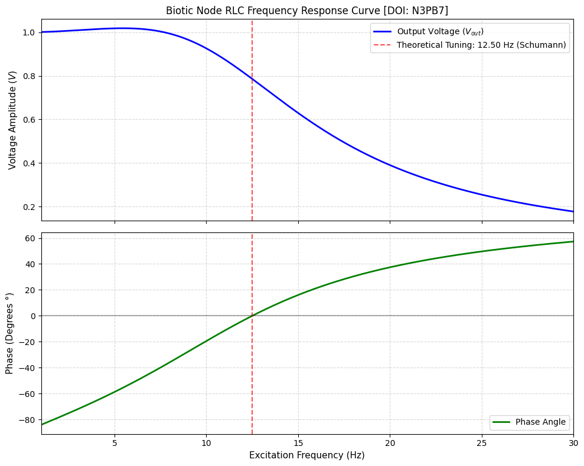
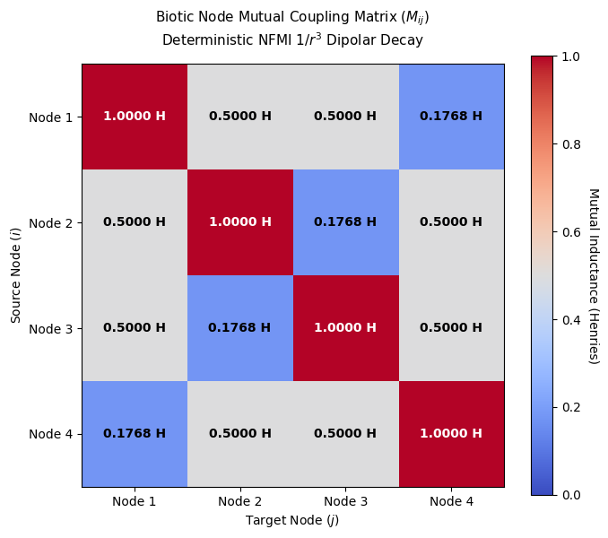

# Biotic Hardware Synthesis: A Computational Framework for Bio-Inspired ELF Resonant Architectures

This repository implements a generative morpho-topological simulation model, not a physical system model. It presents a **computational and exploratory framework** for modeling Biotic Hardware Architectures using lumped-element network representations, in which morphological structures (derived from MS 408 / Voynich Manuscript) are treated as generative inputs for abstract electromagnetic network modeling in Extremely Low Frequency (ELF) regimes and Schumann-resonance-scale dynamics.

The framework is strictly interpretative: it does **not assume physical implementation of biological electromagnetic systems**, but instead investigates whether complex morphological datasets can function as a **generative structural substrate for network-based simulation models**.

---

## Key Research Points

- **Perspective:** Application of signal engineering, applied physics modeling, and bio-inspired computational design to morphological datasets extracted from MS 408.
- **Model:** Modular conceptual architecture based on Near-Field Magnetic Induction (NFMI) network representations using lumped-element approximations and coupled oscillator models.
- **Methodology:** Structural mapping of geometric patterns into graph-based electromagnetic analogues, intended for computational simulation and sensitivity analysis rather than direct physical interpretation.

Simulation baseline:  
[/data/parameters.json](./data/parameters.json)

---

## Objective

- **Computational Hypothesis:** Explore whether morphological datasets (such as MS 408 illustrations) can serve as structured input for generating consistent electromagnetic network topologies in simulation environments.
- **Open Exploration:** Provide reproducible computational tools for simulation, critique, and extension by the research community.
- **Interdisciplinary Inquiry:** Bridge concepts from systems engineering, network physics, and computational morphology for exploratory modeling.

---

## Dataset Rationale (MS 408)

MS 408 (Voynich Manuscript) is used in this project as a morphological dataset.

The choice is not based on any assumed historical, physical, or scientific property of the manuscript. Instead, MS 408 is used because it provides a highly complex and ambiguous visual structure that is useful for testing whether abstract morphological patterns can be mapped into computational network representations.

This makes the dataset function as:
- a high-complexity visual benchmark
- a non-semantic structured morphology source
- a stress-test for abstraction and mapping methods

Other datasets with similar structural complexity (e.g. botanical diagrams, synthetic fractals, or procedural geometry) could be used under the same framework.

---

## Propagation and Signal Flow (Conceptual Model)

The manuscript-inspired structures are interpreted here as a **conceptual mapping layer**, not a historical or physical claim:

- **Source / Grounding Grid:** Abstract representation of baseline node constraints in a network system.
- **Modulation and Filtering:** Structural symmetries mapped to frequency-selective behavior in lumped-element analogies.
- **Inductive Coupling:** Spiral and branching geometries modeled as inductive coupling motifs in NFMI-inspired networks.
- **Phase Synchronization:** Circular and radial structures represented as phase-coupled oscillator arrangements.
- **Material Layering:** Textural differentiation interpreted as parameter variation in simulation environments (e.g., damping, coupling, or loss factors).

---

## Numerical Validation: Node Frequency Response

The repository includes a reproducible numerical model located at:

[/data/node_resonance.py](./data/node_resonance.py)

This script implements a **series RLC resonator model** used as a baseline abstraction for analyzing frequency-dependent behavior in a simplified node system under ELF excitation (1–30 Hz range).

### Core Physics & Mathematical Inputs

The simulation uses fixed analytical parameters:

- **Inductance (L):** 1.0 H  
- **Capacitance (C):** 162 µF (1.62e-4 F)  
- **Resistance (R):** 100 Ω  
- **Input Voltage:** 1.0 V  

The resonance condition is defined by:

$$
f_0 = \frac{1}{2\pi \sqrt{LC}} \approx 12.5 \text{ Hz}
$$

---

### Analysis of Simulation Output

The simulation provides the following observations within the model assumptions:

1. **Phase Transition Behavior:**  
   The phase response crosses the 0° boundary near the theoretical resonance frequency (~12.5 Hz), consistent with standard RLC system behavior.

2. **Damping Effects:**  
   Due to relatively high resistance (R = 100 Ω), the system exhibits strong damping (low Q factor ~0.8), which broadens and flattens the resonance peak.

3. **Network Interpretation:**  
   The isolated node behaves as a strongly damped resonator. This motivates the extension toward multi-node coupling models, where distributed interactions may alter effective resonance behavior through network effects.

> Note: This section describes results strictly within the assumptions of the lumped-element simulation model.

---

## Numerical Model: Mutual Coupling Tensor (M_ij)

The repository also includes a spatial coupling model:

[/data/node_coupling.py](./data/node_coupling.py)

This script computes a **mutual inductance matrix (M_ij)** for a simplified 4-node spatial configuration using a 1/r³ decay approximation typical of near-field dipolar coupling models.

---

### Spatial Configuration

The system is defined on a 2D square grid (0.2 m spacing):

- Node 1: (0.0, 0.0)  
- Node 2: (0.2, 0.0)  
- Node 3: (0.0, 0.2)  
- Node 4: (0.2, 0.2)

---

### Analysis of Coupling Matrix

The resulting matrix represents a simplified interaction model:

1. **Distance-Dependent Coupling:**  
   Coupling strength decreases according to a 1/r³ relationship, consistent with near-field dipole approximations.

2. **Spatial Anisotropy:**  
   Diagonal and orthogonal node distances produce distinct coupling magnitudes, defining a structured interaction topology.

3. **Network Modeling Interpretation:**  
   The resulting matrix can be interpreted as a basis for constructing a multi-port impedance network for further simulation studies.

---

## Relevant Literature (Contextual References)

The following works provide general background for the modeling approaches used in this project:

- Near-Field Magnetic Induction Communication (NFMI) – A Review  
  https://doi.org/10.1016/j.comnet.2020.107548  

- Magnetic Induction Communication: Theory and Applications  
  https://doi.org/10.1109/TAP.2010.2048858  

- Extremely Low Frequency (ELF) Electromagnetic Wave Propagation  
  https://www.nature.com/articles/s41598-024-71011-3  

- Metamaterial-Inspired Antennas: State of the Art and Design Challenges  
  https://doi.org/10.1109/ACCESS.2021.3091479  

- Bio-Inspired Electromagnetic Materials and Structures  
  https://doi.org/10.1021/acsami.2c21622  

- Piezoelectric Properties of Cellulose-Based Materials  
  https://doi.org/10.1016/j.carbpol.2025.124667  

---

## Important Clarification

This project is a **computational and conceptual modeling framework**.

It does NOT claim:
- Historical technological interpretation of MS 408  
- Physical existence of the proposed “biotic hardware systems”  
- Experimental validation of electromagnetic properties in biological structures  

Instead, it provides:
- A reproducible simulation environment  
- A structural mapping methodology  
- A platform for exploratory and interdisciplinary research  

All physical and engineering terminology used in this repository is intended strictly as computational analogy within a simulation framework, and should not be interpreted as empirical, biological, or experimentally validated correspondence.

---

## Voynich Manuscript Reference

MS 408 – Voynich Manuscript  
Beinecke Rare Book & Manuscript Library, Yale University  
https://beinecke.library.yale.edu/collections/highlights/voynich-manuscript
